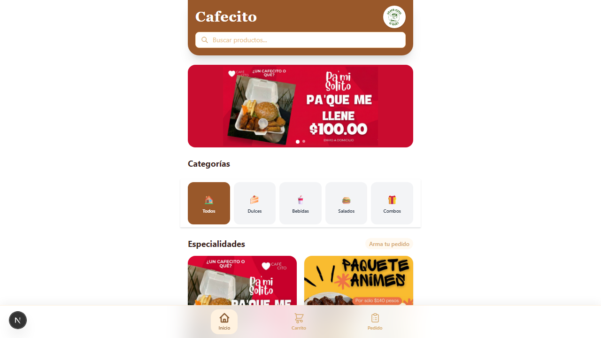
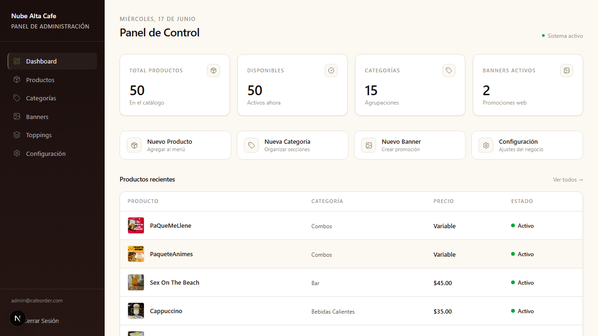

# Cafecito — Menú Digital con Pedidos por WhatsApp

[](https://github.com/cutberto-cast/WhatsCoffee/actions/workflows/ci.yml)

> ⚠️ **Proyecto demo con fines de portafolio.** "Cafecito" no es un negocio real: no se procesan pagos ni pedidos reales. El panel de administración es público a propósito para que puedas explorarlo — usa el botón **"Restaurar datos demo"** en Configuración si quieres devolver los datos a su estado original.

Aplicación full-stack de menú digital para una cafetería: catálogo de productos con variantes/toppings/ingredientes personalizables, carrito, checkout que genera un mensaje de WhatsApp listo para enviar, y un panel de administración completo para gestionar el negocio sin tocar código.

🔗 **Demo en vivo:** https://admin-cafe-two.vercel.app
🔑 **Acceso admin de prueba:** `admin@cafeorder.com` / `admin12345` (en [/admin/login](https://admin-cafe-two.vercel.app/admin/login))

## Capturas

| Tienda (cliente) | Panel de administración |
|---|---|
|  |  |

## Stack

- **Next.js 16** (App Router, Turbopack) + React 19 + TypeScript
- **Supabase**: Postgres con Row Level Security, Auth (email/password) y Storage para imágenes
- **Tailwind CSS 4** + **Zustand** (estado del carrito) + **Zod**
- **Playwright** para verificación end-to-end manual del flujo de compra y admin

## Funcionalidad

**Tienda pública**
- Catálogo filtrable por categoría, con buscador
- Productos con variantes (ej. sabor), toppings opcionales con límite de gratuitos, e ingredientes removibles
- Carrito persistente y checkout que arma el pedido como mensaje de WhatsApp (`api.whatsapp.com/send`)
- Pago por efectivo o transferencia (muestra los datos bancarios configurados por el admin)

**Panel admin** (`/admin`, protegido con Supabase Auth)
- CRUD de productos, categorías, banners promocionales y toppings
- Editor de variantes e ingredientes por producto
- Configuración del negocio (nombre, WhatsApp, color de marca, datos bancarios)
- Subida de imágenes a Supabase Storage
- Botón de **reset a datos demo** (función Postgres `reset_demo_data()`) para que el panel público siempre pueda volver a un estado conocido
- Bloqueo temporal tras 5 intentos fallidos de login (protección básica anti fuerza bruta)

## Arquitectura

```
Next.js (App Router)
 ├─ app/                  rutas públicas (/, /privacidad) y admin (/admin/**)
 ├─ components/           UI de tienda, carrito y admin
 ├─ lib/supabase/         clientes Supabase (browser y server, vía @supabase/ssr)
 ├─ stores/               estado del carrito (Zustand)
 └─ types/                tipos del dominio

Supabase (Postgres + Auth + Storage)
 ├─ RLS: lectura pública en catálogo, escritura solo para usuarios "authenticated"
 ├─ Esquema preparado para multi-tenant (tabla cafeterias / cafeteria_id),
 │  aunque la app actual opera en modo single-tenant
 └─ Función reset_demo_data() para restaurar el seed de demostración
```

## Correr el proyecto localmente

```bash
npm install
cp .env.example .env.local   # completa con tu propio proyecto Supabase
npm run dev
```

### Variables de entorno

| Variable | Descripción |
|---|---|
| `NEXT_PUBLIC_SUPABASE_URL` | URL del proyecto Supabase |
| `NEXT_PUBLIC_SUPABASE_ANON_KEY` | Clave pública (anon) del proyecto Supabase |

El esquema completo (tablas, RLS, políticas de Storage) está en `migracion_variantes_toppings.sql`, `banners_migration.sql` y `reset_demo_data.sql`.

## CI

Cada push a `main` corre lint + build vía GitHub Actions (`.github/workflows/ci.yml`).
